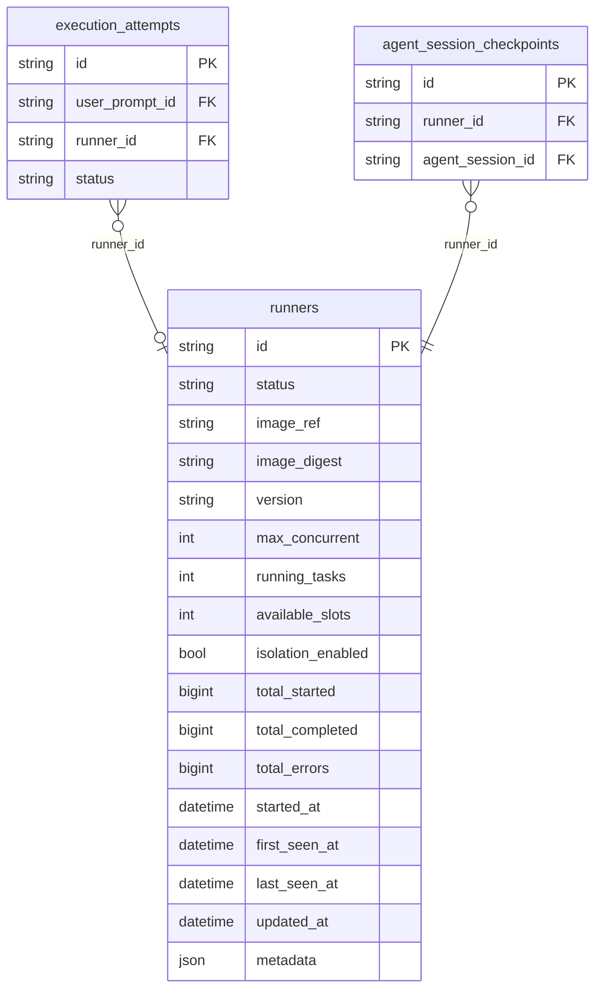
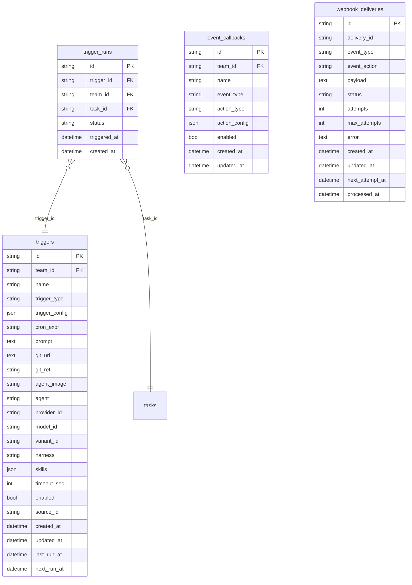
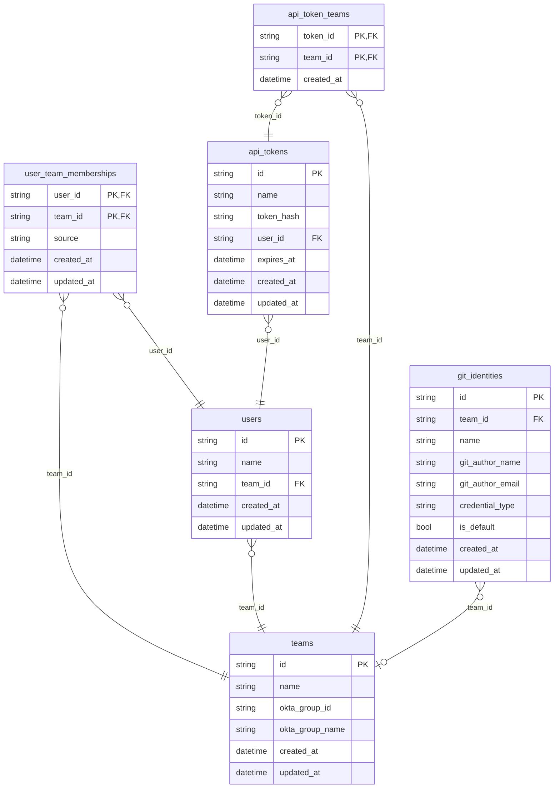
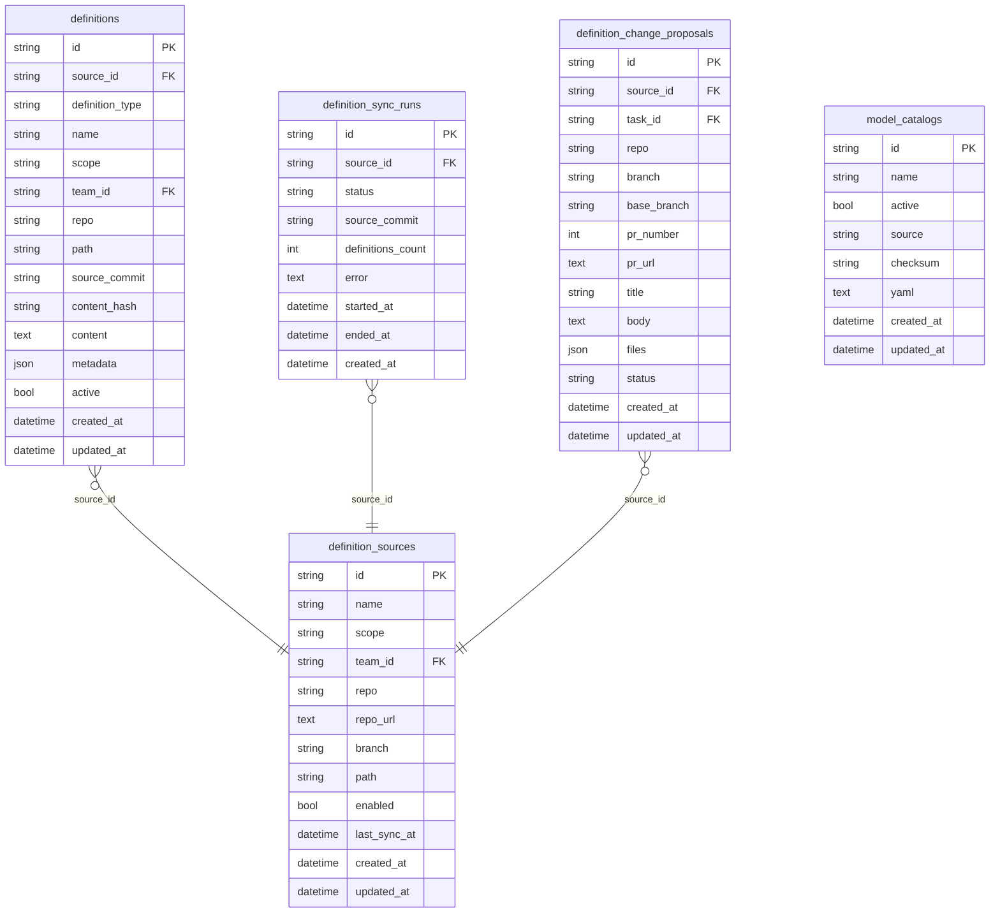
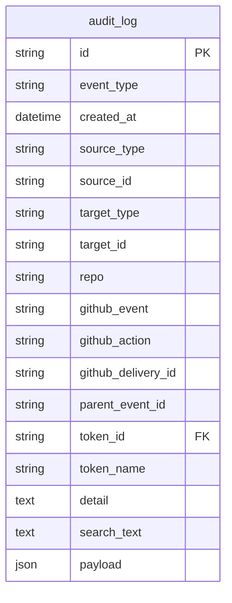

# Chetter Database Schema

Current schema of the `chetter` database, as of migration 053 (2026-08-14,
which added event-callback provenance columns to `tasks`; migration 052
dropped the historical `chetter_` table prefix).
The schema is dialect-agnostic (TiDB / MySQL / PostgreSQL) and uses **no
foreign-key constraints** — relationships below are logical, enforced by the
application. All timestamps are UTC (`datetime(6)`). IDs are prefixed random
strings (`task_`, `sess_`, `prompt_`, `exec_`, `evt_`, ...).

## Core task model

```mermaid
erDiagram
    tasks {
        string id PK
        string team_id FK
        string status
        text prompt
        text git_url
        string git_ref
        string github_repo
        bigint github_installation_id
        string trigger_name FK
        string trigger_type
        string submission_source
        string self_test_run_id
        string self_test_profile
        string self_test_check
        string self_test_nonce
        string callback_parent_task_id
        int callback_depth
        int max_attempts
        text summary
        text error
        string error_category
        string failure_message
        string failure_category
        text search_text
        datetime created_at
        datetime updated_at
        datetime ended_at
    }
    agent_sessions {
        string id PK
        string task_id FK
        int sequence
        string team_id FK
        string status
        string resume_mode
        bool isolation_required
        string pinned_runner_id FK
        string pinned_runner_name
        string checkpoint_id FK
        text workspace_path
        string container_name
        string harness_session_id
        text git_url
        string git_ref
        string agent_image
        string agent
        string provider_id
        string model_id
        string variant_id
        string harness
        json skills
        json mcp_endpoints
        json env
        string commit_author_name
        string commit_author_email
        string git_identity_id FK
        string pause_reason
        text summary
        text error
        text search_text
        datetime created_at
        datetime updated_at
        datetime started_at
        datetime ended_at
        datetime paused_at
        datetime expires_at
    }
    user_prompts {
        string id PK
        string agent_session_id FK
        string task_id FK
        int sequence
        string status
        text prompt
        string source_user_prompt_id FK
        text summary
        text error
        text session_export
        datetime created_at
        datetime updated_at
        datetime started_at
        datetime ended_at
    }
    execution_attempts {
        string id PK
        string user_prompt_id FK
        int sequence
        string status
        string runner_id FK
        string claim_id
        string required_runner_id
        datetime claimed_at
        datetime lease_expires_at
        int timeout_sec
        datetime last_event_at
        datetime started_at
        datetime ended_at
        text workspace_path
        string container_name
        string harness_execution_id
        string runner_image_digest
        text summary
        text error
        string error_category
        text session_export
        bigint total_input_tokens
        bigint total_output_tokens
        bigint total_cache_read_tokens
        bigint total_cache_write_tokens
        bigint total_reasoning_tokens
        bigint cost_cents
        datetime created_at
        datetime updated_at
    }
    task_events {
        string id PK
        string task_id FK
        string agent_session_id FK
        string user_prompt_id FK
        string execution_attempt_id FK
        string subject
        string status
        string event_type
        json payload
        datetime created_at
    }
    agent_session_checkpoints {
        string id PK
        string agent_session_id FK
        string user_prompt_id FK
        string runner_id FK
        text checkpoint_path
        text workspace_path
        string container_name
        string runsc_version
        string agent_image
        bigint size_bytes
        string status
        text error
        datetime created_at
        datetime updated_at
        datetime expires_at
    }
    task_artifacts {
        string id PK
        string task_id FK
        string agent_session_id FK
        string user_prompt_id FK
        string execution_attempt_id FK
        string artifact_type
        string repo
        int number
        text url
        string ref
        string sha
        string discovery_source
        text search_text
        datetime created_at
        datetime discovered_at
    }
    agent_sessions }o--|| tasks : "task_id"
    user_prompts }o--|| agent_sessions : "agent_session_id"
    user_prompts }o--|| tasks : "task_id"
    execution_attempts }o--|| user_prompts : "user_prompt_id"
    task_events }o--|| tasks : "task_id"
    agent_session_checkpoints }o--|| agent_sessions : "agent_session_id"
    task_artifacts }o--|| tasks : "task_id"
```

A **task** is a unit of work (prompt + repo context). Each task gets one or
more **agent sessions** (resumable conversations); each session receives one
or more **user prompts**; each prompt is executed by one or more **execution
attempts** (lease-based claims on a runner). **Task events** are the append-
only event log; **checkpoints** persist resumable gVisor checkpoints;
**artifacts** tracks GitHub issues/PRs/comments created by a task.

## Runner fleet

Runners register and heartbeat via ConnectRPC (upserting this row);
`last_seen_at` older than 60s makes a runner stale. `isolation_enabled`
reflects the runner's advertised gVisor enforcement probe and gates
isolation-requiring tasks at claim time.

## Triggers and automation

**Triggers** fire tasks on cron, PR review, or issue events; each firing is
a **trigger run**. **Event callbacks** react to task lifecycle events with
create_task/webhook/slack actions. **Webhook deliveries** persist inbound
GitHub deliveries for retry/dead-letter handling.

## Teams and auth

API tokens are stored SHA-256 hashed (`token_hash`); tokens belong to one
user and any number of teams (`api_token_teams`). Tasks, triggers,
definitions and callbacks are team-scoped via `team_id`. **Git identities**
are managed author identities for agent commits.

## Definitions and model catalog

Git-backed **definition sources** sync agent/skill/trigger/task-template/
MCP-endpoint **definitions** into the database; **sync runs** log each pull;
**change proposals** are task-created PRs against a definition source. The
**model catalog** holds the active provider/model YAML (checksum-gated).

## Audit log

Append-only record of server-side events: webhook receipts, trigger matches,
task submissions, session resumes, cancellations, token and trigger changes,
model catalog syncs. `parent_event_id` links causally related events.

## Notes

- **No FK constraints**: deleting/repointing rows is an application-level
  operation; the reaper and sync loops own lifecycle transitions.
- **`search_text` columns** back the Full-Text Search path (`FTS_MATCH_WORD`
  on TiDB, `MATCH ... AGAINST` on MySQL, `LIKE` fallback).
- **`metadata`/`payload`/`config` JSON columns** hold per-row schemaless
  detail (runner resource stats, event payloads, trigger configs).
- **`goose_db_version`** tracks applied migrations (`db/migrations/` for
  MySQL/TiDB, `db/postgres/migrations/` for PostgreSQL). On MySQL/TiDB the
  startup `ensure*` path also adds columns idempotently, so a live schema
  may briefly lead the migration files (see `docs/TIDB-WOWBAGGER.md`).
- All `*_sec` ages in TiDB/MySQL queries use `TIMESTAMPDIFF(SECOND, col,
  NOW())`, so the TiDB/MySQL database session must be in UTC. PostgreSQL
  queries use TIMESTAMPTZ/`NOW()` interval arithmetic and are exempt from
  the UTC session requirement (see the time-zone section of
  `docs/TIDB-WOWBAGGER.md`).
