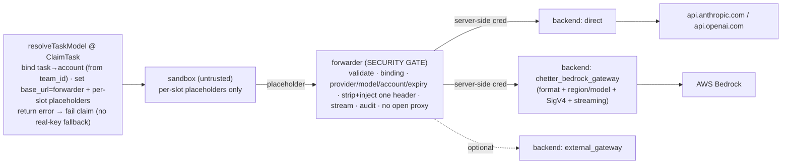

# feat: Chetter credential forwarder + pluggable provider backends — Plan

## Goal Capsule

**Objective.** Keep the **real provider credential out of the agent sandbox**. The sandbox holds only valueless placeholders; a forwarder outside the sandbox swaps in the real credential and makes the call on the agent's behalf. For Bedrock, Chetter provides the gateway backend so the customer deploys nothing.

**Product authority.** `ce-plan-bootstrap` (in-session 2026-06-27; refined by a 3-codebase gap analysis — chetter / smith9 / run9).

**Open blockers.** None. Per-team RBAC and at-rest KMS encryption are deferred but named.

---

## How it works (in plain terms)

**One line:** the real key never enters the sandbox. The sandbox holds only a worthless **placeholder**; a **forwarder** outside the sandbox recognizes the placeholder, swaps in the real key, and makes the call for the agent.

**Four parts**

1. **Sandbox (the agent)** — holds only two things: the forwarder address (`ANTHROPIC_BASE_URL=<forwarder>`) and a **placeholder per credential** (`ANTHROPIC_AUTH_TOKEN=chttr-fake-task123-anthropic`). No real key anywhere in it.
2. **Forwarder (the security gate — on the runner, outside the sandbox)** — for each request: validate the placeholder → look up which real key it maps to → **delete the placeholder, inject the real key** → forward upstream and stream the response back → write a token-free audit row.
3. **Binding (server-side table)** — `(task/box, slot) → { real key, upstream host, which header }`, created at claim time by the **server**, with the account derived from the task's `team_id`.
4. **Backend (where the forwarder sends the request)** — `direct` for Anthropic/OpenAI (inject the real key, forward to the provider); `chetter_bedrock_gateway` for Bedrock (a Chetter-provided gateway does the AWS SigV4 / format work, so the gate never touches signing).

**A request, end to end**

```
① Claim time (server):   derive account from task.team_id
                          → create binding: placeholder chttr-fake-task123-anthropic → real key sk-ant-REAL…
                          → give the box: BASE_URL=forwarder, AUTH_TOKEN=placeholder
② In the sandbox:         the agent uses the placeholder as its key and calls the FORWARDER (not Anthropic)
③ Forwarder:              validate placeholder → look up binding → delete placeholder, inject real key
                          → forward (Anthropic/OpenAI directly; Bedrock via the Chetter gateway) → stream back
④ Result:                 the real key never entered the sandbox; on task end the binding/placeholder is revoked
```

**Six rules that make it correct**

1. The real key **never enters the sandbox** — and there are **two** doors to close: `claudeEnv` *and* `runnerOwnedEnvKeys` (the runner copies host keys into every container).
2. Placeholders are **valueless, one per credential slot, and valid only on the sandbox→forwarder hop** (rejected anywhere past the gate).
3. The account is **derived server-side from `team_id`** — never trust the runner or the box (the runner is a shared admin worker, not a per-team identity).
4. On **any** failure (no binding, backend down), **fail the claim** — never fall back to putting a real key in the box.
5. **No forging CA** — the forwarder is an explicitly-configured normal endpoint (normal TLS cert), not transparent interception.
6. **No customer-deployed dependency** — Chetter provides the Bedrock gateway backend.

Everything below just makes these four parts and six rules precise for an implementer.

---

## Problem Frame

Today the real credential is injected into the sandbox verbatim, on **two** paths, and is readable by the untrusted agent:
1. `claudeEnv` sets `ANTHROPIC_AUTH_TOKEN`=`os.Getenv(api_key_env)` — the real key — into the box (`runner/harness/claude/resolve.go:49-58`).
2. `runnerOwnedEnvKeys` **unconditionally** copies host `ANTHROPIC_*`/`OPENAI_API_KEY`/etc. into **every** container (`runner/internal/controller/runner_task.go:223-246, 599-603, 817-821, 1079-1083`).

The agent can read `/proc/self/environ`, the workspace, and the copied `auth.json` in local mode (`config.go:113-153`), and exfiltrate. Closing only path 1 still leaks via path 2.

**Things the earlier draft got wrong (fixed here):** `claude-serve-proxy` is an in-box CLI wrapper, **not** a forwarder (`main.go:274-302`); the egress proxy CONNECT-tunnels HTTPS (no header rewrite) and is gVisor-only — reusable as an upstream allowlist, not as the gate; tenancy is **server-derived from `team_id`**, not claim-authenticated (the runner is admin-scoped, `internal/auth/resolve.go:14-16`, and `team_id` isn't even in the proto Task, `runner_rpc.go:994-1020`).

---

## Requirements

- **R1.** The real provider credential (provider API key, AWS/Bedrock identity, any gateway credential) is **never present in the sandbox**. For forwarded providers, **both** injection sites (`claudeEnv` and `runnerOwnedEnvKeys`) emit only the placeholder.
- **R2.** The sandbox holds only **per-task placeholders — one per credential slot** — each valueless outside the forwarder; leaking one reveals nothing about the others.
- **R3.** A task that can't be bound, or whose backend is unavailable, **fails the claim** — it **never** falls back to injecting a real key.
- **R4.** Each credential use is audited (task, provider, account — never token, key, or prompt body).
- **R5.** Additive: providers not on the forwarder path behave exactly as today.
- **R6.** **No customer-required external dependency.** Default deployment works without the operator standing up a gateway; Chetter provides the Bedrock backend. External gateway optional.
- **R7.** **Account is server-derived** from `chetter_tasks.team_id`; the forwarder never trusts runner/box-asserted identity. (Per-team RBAC is a separate, deferred design.)
- **R8.** **Forwarder ↔ store auth + hygiene.** The forwarder authenticates to the binding store with a server-minted non-forgeable per-box token (HMAC-derived) + a live-lease check; placeholder validation is constant-time; secret files are atomic 0600 + symlink-rejecting; host matching rejects IP literals and uses exact / `*.suffix`; the forwarder is not an open proxy.
- **R9.** **First-hop-only placeholder** — valid only sandbox→forwarder; the forwarder→backend hop uses a separate server-side credential.

---

## Key Technical Decisions

- **KTD1 — Forwarder = security gate; backend = provider adapter.** New reverse proxy on the runner: validate → bind-check (provider/model/account/expiry) → strip+rewrite one named auth header → route to backend → audit. Fully greenfield. Primary reference = smith9's run9-BoxSecret path (`provider_secret.go`, `protectedClaudeProviderSecretsForEnv:2654-2688`, `run9.go`); transport reference = `codex_proxy.go` (SSE, header strip/passthrough).
- **KTD2 — No forging CA.** Box explicitly points at the forwarder (normal cert / internal HTTP). FSA-clean alternative to run9's transparent MITM CA.
- **KTD3 — Bedrock is gateway-backed first.** `direct` for Anthropic/OpenAI; Bedrock via a Chetter-provided gateway (format/region/model/streaming/SigV4), initially over a proven gateway. Native SigV4 deferred. (smith9's `AWS_BEARER_TOKEN_BEDROCK` passthrough is a viable fast interim.)
- **KTD4 — One placeholder per slot; account server-derived from `team_id`** (R7), never agent-supplied.
- **KTD5 — Credential provenance is a decoupled external op** (static / mint / STS / rotate just write the binding; the data path never changes).
- **KTD6 — Pluggable `backend.kind ∈ {direct, chetter_bedrock_gateway, external_gateway, native_bedrock(deferred)}`** as **new** catalog fields (do not overload `Provider.Kind`).
- **KTD7 — Never fall back to a real key in the box.** Deliberate inversion of smith9's `shouldProtectManagedProviderAPIKeyForEnv` (which silently injects the real key when its protected path is unavailable): we fail the claim (R3).
- **KTD8 — Adopt run9 hardening; port its crypto.** Port `run9/portal/api/secret_crypto.go` (AES-256-GCM, AAD-bound) ~verbatim. Adopt the broker-token chain (HMAC per-box token + live-lease) for R8, `subtle.ConstantTimeCompare`, atomic 0600/symlink-safe writes, IP-literal-rejecting host matcher, `ReverseProxy{FlushInterval:-1}` streaming. Do **not** copy run9's `strings.ReplaceAll` substitution or `inject_header_name='*'`.

---

## High-Level Technical Design



---

## Implementation Units

### U1. Forwarder (security gate) + `direct` backend (Anthropic, OpenAI) — do first
- **Goal.** Real key out of the box for the common case; both injection paths closed; box holds only per-slot placeholders.
- **Requirements.** R1, R2, R3, R4, R6, R7, R8, R9.
- **Dependencies.** none.
- **Files.** `runner/cmd/cred-forwarder/` (the gate), `internal/service/runner_rpc.go` (resolveTaskModel: derive account from `team_id`, create binding, set `base_url`=forwarder + per-slot placeholders, **return error + roll back the claim tx** on failure), `runner/harness/claude/resolve.go:49-58` (forwarded → placeholder), `runner/internal/controller/runner_task.go:223-246,599-603,817-821,1079-1083` (**gate `runnerOwnedEnvKeys` by `auth_mode`**; `GITHUB_TOKEN`/non-model keys unchanged), `pkg/modelcatalog/catalog.go` (new `auth_mode`+`backend` fields), `internal/crypto/secretbox.go` (port run9), audit RPC, tests.
- **Approach.** Forwarder on the runner (runner IP already allowlisted, `runner.go:156-168`). Box gets `ANTHROPIC_BASE_URL=<forwarder>` + per-slot placeholders. Gate per request: constant-time validate placeholder → resolve binding `(box,slot)→{cred,upstream,header}` → check not expired/revoked + provider/model/account match (**net-new**, not free from ported code) → strict delete-then-inject one named header → open-list `anthropic-*` business passthrough → stream (`FlushInterval:-1`) → token/prompt-free audit. Store auth per R8 (HMAC per-box token + live-lease). `direct` forwards to the provider. Any failure → fail the claim (KTD7), never a real key. Primary ref: smith9 run9-BoxSecret path; transport: `codex_proxy.go`.
- **Patterns to follow.** smith9 `provider_secret.go` / `protectedClaudeProviderSecretsForEnv:2654-2688` / `run9.go`; `codex_proxy.go` (SSE); run9 `secret_crypto.go`, `box_runtime_credential_signer.go`, `project_secret_runtime.go:196` (constant-time).
- **Test scenarios.** Anthropic+OpenAI task → gate injects real header → 200, streaming + beta passthrough; real key absent from proto Task, **both** env paths, workspace. Critical: a forwarded task's container `-e` args contain **no** real key value (closes path 2). Placeholder for a finished/other task or presented past the forwarder → rejected (R9). Binding/backend unavailable → claim fails, no real key (KTD7). Agent cannot redirect upstream (R8). Audit row is token/prompt-free.
- **Verification.** Forwarded tasks run with only placeholders on both paths; failure fails the claim with no real-key fallback.

### U2. Bedrock via Chetter-provided gateway backend
- **Goal.** Same property for Bedrock — AWS identity/signing never reach the box — without hand-rolling SigV4 in the gate.
- **Requirements.** R1, R2, R3, R4, R6, R7, R9.
- **Dependencies.** U1.
- **Files.** `runner/cmd/cred-forwarder/backend_bedrock_gateway.go` (route to the Chetter Bedrock gateway with a server-side credential), deploy/config for the bundled gateway (LiteLLM/agentgateway/wrap; AWS identity via IRSA/role) + gateway host on the egress allowlist, `pkg/modelcatalog` (`backend.kind: chetter_bedrock_gateway`), tests.
- **Approach.** Box runs Claude in Anthropic mode pointed at the forwarder with a placeholder; the gate validates+binds, then routes to the Chetter-provided Bedrock gateway with a **server-side** credential (R9). The backend does Anthropic↔Bedrock format, region/model, `InvokeModelWithResponseStream`, SigV4 with its held/assumed AWS identity. No AWS/gateway credential enters the box. `external_gateway` optional; `AWS_BEARER_TOKEN_BEDROCK` passthrough as a fast interim if needed.
- **Test scenarios.** Bedrock task → gate → Chetter gateway → 200, streaming; no AWS/gateway credential in the box. Misconfig → claim fails (KTD7). Region/model mapping; placeholder not forwarded onward (R9).
- **Verification.** Bedrock task runs with no AWS/gateway credential in the box; signing only in the backend.

---

## Scope Boundaries

**In scope.** Forwarder gate + `direct` backend (U1, both paths closed); Bedrock via Chetter gateway (U2); per-slot placeholders (server-derived account); first-hop-only; run9 hardening + at-rest crypto port; token-free audit.

### Deferred (named, out of scope here)
- **`native_bedrock`** (Chetter doing AWS SDK SigV4 directly) — after U1 + gateway-backed U2.
- **Subscription OAuth** (Claude `setup-token`, Codex PKCE) — native-file injection, separate opt-in/non-prod track; new **codex harness**.
- **Non-model secrets** (`GITHUB_TOKEN`, tool/MCP creds) via the gate — they stay on the current path until then. **Known limitation:** rejecting run9's CA-MITM (KTD2) means these non-base_url secrets are not forwarder-covered until this lands (run9 covers them for free; we choose not to).
- **Per-team RBAC / per-team runner identity** — separate "tenancy & runner identity" design; here we only need server-side `team_id` derivation (R7).
- **At-rest KMS/HSM + rotation** for the now-server-concentrated keys — named, not built (the `secretbox.go` port is the at-rest cipher; custody/rotation is the follow-up).

---

## Risks & Dependencies

- Bundled Bedrock gateway is a new operated component — base it on a proven gateway, Chetter-managed (R6).
- Forwarder is in the request path — must stream + strict auth rewrite + business passthrough; thin gate on the runner.
- Forwarder TLS — normal server cert in the agent image (not a forging CA), or internal HTTP.
- **Plaintext-at-rest (named limitation)** — smith9 stores secrets plaintext; this plan concentrates real keys server-side, so schedule envelope/KMS encryption.
- **Non-gVisor egress bypass** — the egress allowlist is gVisor-only (`runner_task.go:576-587`); for non-gVisor, R7/R8 "no open proxy" must be enforced by the forwarder/backend allowlist itself.
- Local-mode `auth.json` copy (`config.go:113-153`) — ensure the forwarded path doesn't rely on it; gate to trusted local dev.

---

## Verification Contract

- **R1** — real key/AWS/gateway credential absent from proto Task, **both** env paths, and workspace.
- **R2** — box holds only per-slot placeholders, valueless outside the forwarder.
- **R3 / KTD7** — binding/backend failure fails the claim; no real-key fallback ever.
- **R4** — each use writes a token/prompt-free audit row.
- **R5** — non-forwarded providers unchanged.
- **R6** — default deployment incl. Bedrock works with no customer-deployed gateway.
- **R7** — account derived server-side from `team_id`.
- **R8** — constant-time validation; per-box token + live-lease store auth; 0600/atomic/symlink-safe files; no open proxy.
- **R9** — placeholder rejected past the forwarder.

## Definition of Done

Anthropic/OpenAI (U1) and Bedrock (U2) tasks run with only per-slot placeholders in the sandbox; the real provider/AWS/gateway credential is never present on **either** env path or in the workspace (R1); placeholders valueless/per-slot/first-hop (R2,R9); binding/backend failure fails the claim with no fallback (R3/KTD7); account server-derived (R7); store auth + hardening in place (R8); audit token/prompt-free (R4); non-forwarded providers unchanged (R5); no customer gateway required (R6). Native SigV4, subscription OAuth, non-model secrets, per-team RBAC, and at-rest KMS remain deferred/named.

---

## Sources & Research

In-session investigations + 3-codebase gap analysis (2026-06-27). Chetter: two injection paths (`runner/harness/claude/resolve.go:49-58`; `runner/internal/controller/runner_task.go:223-246,599-603,817-821,1079-1083`); `resolveTaskModel` void/fire-and-forget (`internal/service/runner_rpc.go:166,192`); `team_id` on tasks but not in proto (`runner_rpc.go:994-1020`), runner admin-scoped (`internal/auth/resolve.go:14-16`); `claude-serve-proxy` in-box CLI wrapper (`runner/cmd/claude-serve-proxy/main.go:274-302`); egress proxy CONNECT-tunnel, gVisor-only (`runner/internal/network/proxy.go`, `runner_task.go:576-587`); `chetter_audit_log`+`LogAuditEvent` token-free (`internal/store/schema.go:245`, `service.go:1410`); runner IP allowlisted (`runner.go:156-168`); zero-code base_url routing (`resolve_test.go:35-54`). smith9: gate+placeholder = run9-BoxSecret path (`provider_secret.go`, `protectedClaudeProviderSecretsForEnv:2654-2688`, `run9.go`); transport `codex_proxy.go`; insecure fallback to avoid (`shouldProtectManagedProviderAPIKeyForEnv:2742`); plaintext `SecretJSON`; deferred subscription = `openai_codex_oauth.go` + refresh `project_auth_service.go:2995-3093` + `marshalManagedCodexAuthJSON:286`. run9: `secret_crypto.go` (port), broker-token chain (`box_runtime_credential_signer.go`) + live-lease, `subtle.ConstantTimeCompare` (`project_secret_runtime.go:196`), atomic 0600/symlink-safe writes, IP-literal-rejecting host matcher, `ReverseProxy{FlushInterval:-1}`.
