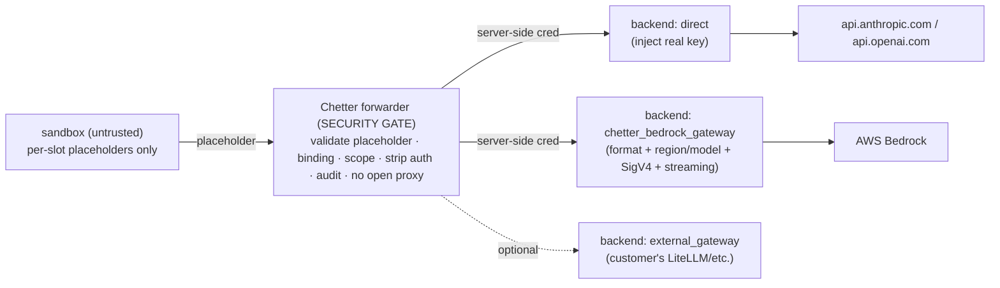

# feat: Chetter credential forwarder + pluggable provider backends — Plan

## Goal Capsule

**Objective.** Keep the **real provider credential out of the agent sandbox** with one **security gate** (a Chetter credential forwarder) in front of **pluggable provider backends**. The sandbox holds only per-task, per-credential **placeholders**; the forwarder validates them and routes to a backend that injects the real credential outside the box. No *customer*-deployed dependency: for Bedrock, Chetter provides the gateway backend.

**Product authority.** `ce-plan-bootstrap` (in-session 2026-06-27, refined by review: forwarder = security boundary; provider complexity = pluggable backend; Bedrock gateway-backed, not hand-rolled).

**Open blockers.** None. Bedrock's complexity is delegated to a provider backend (U2), not the forwarder.

---

## Problem Frame

Today the credential is injected into the sandbox verbatim and is readable by the untrusted agent: `resolveTaskModel` stamps `ProviderApiKeyEnv` (`internal/service/runner_rpc.go:192-216`); the runner injects `os.Getenv(that)` via `runnerOwnedEnvKeys` (`runner/internal/controller/runner_task.go:223-246`); `claudeEnv` sets it as `ANTHROPIC_AUTH_TOKEN`/`ANTHROPIC_API_KEY` (`runner/harness/claude/resolve.go:30-68`); local mode also copies host `auth.json` into the workspace (`config.go:113-153`). The agent runs as that uid, can read `/proc/self/environ` and the workspace, and can exfiltrate. So whatever `api_key_env` names leaks — and if it is a real provider key / Bedrock credential, the high-value secret is exposed.

**Fix:** put a **forwarder (security gate)** between the sandbox and **pluggable provider backends**. The sandbox only ever holds placeholders; real credentials live behind the forwarder/backends.

---

## Requirements

- **R1.** The real provider credential (provider API key, AWS/Bedrock identity, any gateway credential) is **never present in the sandbox**.
- **R2.** The sandbox holds only **per-task placeholders — one per credential kind/slot** — each **valueless** outside the forwarder and bound to that task; leaking one reveals nothing about the others.
- **R3.** A task whose placeholder can't be validated/bound **fails the claim** — never launches with a real key.
- **R4.** Each credential use is audited (task, provider, account — never the token, key, or prompt body).
- **R5.** Additive: providers not on the forwarder path behave exactly as today.
- **R6.** **No customer-required external dependency.** The default deployment works without the operator standing up a separate gateway; for Bedrock, **Chetter provides the gateway backend**. An existing external gateway *may* be integrated, but is optional.
- **R7.** **First-hop-only placeholder.** The sandbox placeholder is valid only on the sandbox→forwarder hop. The forwarder→backend hop uses a **separate server-side credential**; the placeholder is never passed onward as a credential. The forwarder is not an open proxy: the agent cannot choose the upstream host, and only allowlisted provider backends are reachable.

---

## Key Technical Decisions

- **KTD1 — Forwarder = security gate; backend = provider adapter.** A small Chetter reverse proxy on the **runner** (outside the sandbox) is the single security entry point: it validates the placeholder, checks the per-slot binding (task/run/slot/provider/model/account, not expired/revoked), strips the sandbox-supplied auth header, routes to the configured **backend**, and audits. Provider-specific complexity lives in the backend, not the gate. Port the gate shape from smith9 `internal/controlplane/codex_proxy.go`.
- **KTD2 — No forging CA.** The box is *explicitly* pointed at the forwarder (`ANTHROPIC_BASE_URL` / OpenAI `base_url`), so this is not interception — the forwarder presents a **normal server cert** (baked into the agent image) or runs plain HTTP on the runner-internal network. The FSA-clean alternative to run9-style transparent MITM.
- **KTD3 — Bedrock is gateway-backed first, not hand-rolled.** Anthropic/OpenAI use a `direct` backend (inject real key, forward to the provider). **Bedrock routes through a Chetter-provided Bedrock gateway backend** that handles Bedrock API format, model/region mapping, streaming (`InvokeModelWithResponseStream`), and **SigV4** — initially implemented over a proven gateway (LiteLLM / agentgateway / a Chetter wrap), so we don't hand-roll SigV4 in the security gate. A customer-provided external gateway is an optional backend. A **native** Bedrock-SigV4 backend is deferred.
- **KTD4 — One placeholder per credential kind, bound at claim scope.** Each credential slot the box needs (Anthropic, OpenAI, Bedrock, … and, later, git/tool secrets) gets its **own** placeholder, bound to the task/session server-side from the authenticated claim scope (never agent-supplied). Several providers → several placeholders, each independently routed/revocable; a leak of one is useless and reveals nothing about the others. The run9 Box-Secret model.
- **KTD5 — Credential provenance is a decoupled external management op.** How the real credential bound to a slot is *sourced or rotated* — statically configured, periodically minted (gateway virtual key / STS), or obtained out-of-band — is pluggable and orthogonal; each just writes/refreshes the binding. The forwarder/data-path never changes.
- **KTD6 — Pluggable backend kinds.** `backend.kind ∈ {direct, chetter_bedrock_gateway, external_gateway, native_bedrock(deferred)}`. The forwarder→backend hop always uses a **server-side** credential, never the sandbox placeholder (R7). This is the single abstraction that unifies U1 (`direct`) and U2 (`chetter_bedrock_gateway`).

---

## High-Level Technical Design

---

## Implementation Units

### U1. Forwarder (security gate) + `direct` backend (Anthropic, OpenAI) — main line, do first
- **Goal.** Real key out of the box for the common case; sandbox holds only per-slot placeholders.
- **Requirements.** R1, R2, R3, R4, R6, R7.
- **Dependencies.** none.
- **Files.** `runner/cmd/cred-forwarder/` (gate: validate placeholder → check binding → strip auth → `direct` backend injects real key → stream passthrough → audit), `internal/service/runner_rpc.go` (resolveTaskModel: bind per-slot, set `base_url`=forwarder + per-slot placeholders, return error on failure), `runner/harness/claude/resolve.go` + `runner/internal/controller/runner_task.go` (point harness env at the forwarder; never inject a real key for forwarded providers), `pkg/modelcatalog/catalog.go` (`auth_mode: forwarded`, `backend.kind`), tests.
- **Approach.** The forwarder runs on the runner (reachable via the existing egress path; runner IP already allowlisted, `runner/internal/controller/runner.go:156-168`). The box gets `ANTHROPIC_BASE_URL=<forwarder>` + per-slot placeholders (`ANTHROPIC_AUTH_TOKEN=<ph>`, OpenAI `base_url`+`<ph>`). On each request the gate: validates the placeholder; resolves the binding `(box/run, slot) → {real cred, upstream, inject-header}` from claim scope; confirms not expired/revoked and provider/model/account match; **strictly rewrites the auth header** (delete sandbox-supplied, inject real); **transparently passes through business headers/body** (open-list `anthropic-*` beta headers + body fields, so new Claude Code features don't break); **streams** the response (no buffering — Claude Code blocks otherwise); audits (no token/key/prompt). For `direct`, the gate forwards to the real provider. `resolveTaskModel` returns an error so a binding failure fails the claim (R3). Real creds held server-side, never in the box; provenance per KTD5 (static first; mint/STS later). TLS per KTD2.
- **Patterns to follow.** smith9 `codex_proxy.go` (placeholder→real injection + streaming); existing `resolveTaskModel` stamping.
- **Test scenarios.** Happy: Anthropic + OpenAI task → gate injects real header → upstream 200, streaming works, beta headers pass through; real key absent from proto Task, container env, workspace. Edge: placeholder for a finished/other task/slot → rejected. Error: binding failure → claim fails fast (no launch with a real key). Security: agent reads env/files → only placeholders, useless elsewhere; agent cannot redirect the upstream host (no open proxy, R7). Audit: token-free row per use, no prompt body logged.
- **Verification.** Anthropic/OpenAI tasks run with only placeholders in the box; real key never present; streaming + beta-header passthrough work; a binding failure fails the claim.

### U2. Bedrock via Chetter-provided gateway backend
- **Goal.** Same property for Bedrock — AWS identity and signing never reach the box — without hand-rolling SigV4 in the gate.
- **Requirements.** R1, R2, R3, R4, R6, R7.
- **Dependencies.** U1.
- **Files.** `runner/cmd/cred-forwarder/backend_bedrock_gateway.go` (route to the Chetter-provided Bedrock gateway with a server-side gateway credential), deploy/config for the bundled gateway (initially LiteLLM/agentgateway/Chetter-wrap, holding/assuming the AWS identity via IRSA/role), `pkg/modelcatalog` (`backend.kind: chetter_bedrock_gateway`), tests.
- **Approach.** The box still runs Claude in normal Anthropic mode pointed at the forwarder with a placeholder. The gate validates + binds, then routes to the **Chetter-provided Bedrock gateway backend** using a **server-side gateway credential** (R7 — not the placeholder). That backend does Anthropic↔Bedrock format, model/region mapping, `InvokeModelWithResponseStream` streaming, and SigV4 with its held/assumed AWS identity. **No AWS credential and no gateway credential ever enter the box.** The bundled gateway is a product capability (customer deploys nothing). **Optional:** `backend.kind: external_gateway` to route to a customer's existing gateway instead.
- **Patterns to follow.** LiteLLM / agentgateway Anthropic→Bedrock + SigV4 (used *as* the backend, not reimplemented in the gate); AWS SDK SigV4 signer (for a future native backend).
- **Test scenarios.** Happy: Bedrock task → gate → Chetter Bedrock gateway → 200, streaming works; no AWS/gateway credential in the box. Error: backend/identity misconfigured → claim fails (not a doomed launch). Edge: region/model mapping; placeholder not forwarded onward (R7). Optional: `external_gateway` routes to a configured customer gateway.
- **Verification.** A Bedrock task runs with no AWS/gateway credential anywhere in the box; signing happens only in the backend; the sandbox placeholder is not used past the forwarder.

---

## Scope Boundaries

**In scope.** Forwarder security gate + `direct` backend (U1); Bedrock via Chetter-provided gateway backend (U2); per-slot placeholder binding; first-hop-only placeholder; no customer-required dependency.

### Deferred (out of scope for this problem)
- **`native_bedrock` backend** — Chetter directly doing AWS SDK SigV4 (AWS recommends SDK over hand-rolled signing). Add only after U1 + gateway-backed U2 are stable.
- **Subscription OAuth** (Claude `setup-token`, Codex PKCE) — native-file injection, a separate opt-in/non-prod track; the new **codex harness**.
- Extending placeholders to non-model secrets (git PAT, tool/MCP creds) via the same gate — same pattern, later.
- Per-team RBAC; KMS/HSM rotation for backend-held secrets.

---

## Risks & Dependencies

- **Bundled Bedrock gateway is a new operated component.** Mitigation: base it on a proven gateway (LiteLLM/agentgateway) rather than hand-rolling; it's Chetter-managed, customer deploys nothing (R6).
- **Forwarder is in the request path** — must stream and be reliable/low-latency, with strict auth rewrite + open-list business passthrough. Mitigation: thin gate, runs next to the box on the runner.
- **Forwarder TLS** — needs a normal server cert trusted in the agent image (NOT a forging CA), or plain HTTP on the runner-internal network.
- **First-hop placeholder discipline (R7)** — the gate must never pass the sandbox placeholder onward as a credential; the forwarder→backend hop uses a server-side credential. Test explicitly.
- **Local mode `auth.json` copy** (`config.go:113-153`) can place creds in the workspace — ensure the forwarded path doesn't rely on it; gate host-copy to trusted local dev.

---

## Verification Contract

- **R1** — for a forwarded (Anthropic/OpenAI/Bedrock) task, the real key / AWS / gateway credential is absent from the proto Task, container env, and workspace.
- **R2** — the box holds only per-slot placeholders, each valueless outside the forwarder.
- **R3** — a binding/validation failure fails the claim; no task launches with a real key.
- **R4** — each use writes a token-free audit row; no prompt body logged.
- **R5** — a non-forwarded provider resolves and runs identically to today.
- **R6** — the default deployment (incl. Bedrock) works with no customer-deployed gateway.
- **R7** — the sandbox placeholder is rejected if presented past the forwarder; the agent cannot redirect the upstream host.

## Definition of Done

Anthropic/OpenAI tasks (U1) and Bedrock tasks (U2, via the Chetter-provided gateway backend) run with only per-slot placeholders in the sandbox; the real provider/AWS/gateway credential is never present in env or workspace (R1); placeholders are valueless, per-slot, first-hop-only (R2, R7); a binding failure fails the claim (R3); use is audited without secrets/prompt bodies (R4); non-forwarded providers unchanged (R5); no customer-deployed gateway required (R6). Native Bedrock SigV4 and subscription OAuth remain deferred.

---

## Sources & Research

In-session investigations (2026-06-27): current credential injection (`runner/harness/claude/resolve.go:30-68`, `runner/internal/controller/runner_task.go:223-246`, `internal/service/runner_rpc.go:166,192-216`, `runner/harness/claude/config.go:113-153`); egress allowlist already covers the runner IP (`runner/internal/controller/runner.go:156-168`); zero-code base_url routing proven by `runner/harness/claude/resolve_test.go:35-54`. Forwarder gate shape ported from smith9 `internal/controlplane/codex_proxy.go`. Claude Code gateway contract: inference responses must stream; `anthropic-*` beta headers/body fields must pass through (open-list) so new features keep working; auth via `ANTHROPIC_BASE_URL`+`ANTHROPIC_AUTH_TOKEN`. Bedrock: `InvokeModel` / `InvokeModelWithResponseStream` for Claude Messages; SigV4 best done via AWS SDK (→ gateway backend, not hand-rolled). Deferred subscription/OAuth track follows smith9/run9.
